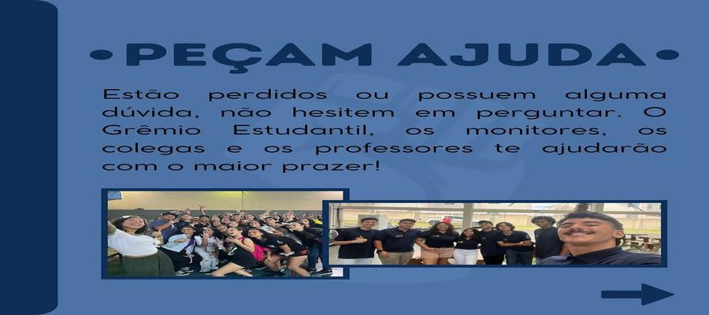

<html lang="pt-br">
<head>
  <meta charset="UTF-8">
  <meta name="viewport" content="width=device-width, initial-scale=1.0">
  <title>Grêmio Estudantil</title>
  <link rel="stylesheet" href="style.css">
</head>
<body>
  <header>
    <h1>Grêmio Estudantil</h1>
    <nav>
      <ul>
        <li><a href="index.html">Início</a></li>
        <li><a href="quem-somos.html">Quem Somos</a></li>
        <li><a href="eventos.html">Eventos</a></li>
        <li><a href="contato.html">Contato</a></li>
      </ul>
    </nav>
  </header>

  <main class="container">

    <!-- Carrossel de fotos -->
    <section class="carousel">
      <button class="prev" onclick="mudarSlide(-1)">&#10094;</button>
      

        
        
        
        
        
      

      <button class="next" onclick="mudarSlide(1)">&#10095;</button>
    </section>

    <!-- Seção de Boas-Vindas -->
    <section class="box">
      <h2>Bem-vindo!</h2>
      
Este é o site oficial do Grêmio Estudantil. Aqui você encontra informações sobre quem somos, nossos eventos e formas de contato.

      
Acompanhe nossas últimas novidades e participe das atividades que promovemos!

    </section>

    <!-- Notícias e Atualizações -->
    <section class="news">
      <h2>Últimas Notícias</h2>
      <article>
        <h3>Título da Notícia</h3>
        
Descrição breve da notícia. <a href="#">Leia mais...</a>

      </article>
      <article>
        <h3>Outro Título</h3>
        
Resumo da segunda notícia. <a href="#">Leia mais...</a>

      </article>
    </section>

    <!-- Galeria de Fotos e Vídeos -->
    <section class="gallery">
      <h2>Galeria</h2>
      

        
        
        
      

    </section>

    <!-- Destaques da Semana -->
    <section class="highlights">
      <h2>Destaques da Semana</h2>
      
Aqui destacamos as principais atividades da semana no Grêmio!

    </section>

    <!-- Enquete Interativa -->
    <section class="poll">
      <h2>Enquete</h2>
      
Qual atividade você gostaria de ver no próximo evento?

      <form>
        <input type="radio" name="vote" value="1"> Campeonato de Jogos  
        <input type="radio" name="vote" value="2"> Oficina de Arte  
        <input type="radio" name="vote" value="3"> Gincana Estudantil  
        <button type="submit">Votar</button>
      </form>
    </section>

    <!-- Agenda de Eventos -->
    <section class="events">
      <h2>Próximos Eventos</h2>
      <ul>
        <li>Evento X - 10 de Abril</li>
        <li>Evento Y - 15 de Abril</li>
        <li>Evento Z - 20 de Abril</li>
      </ul>
    </section>

    <!-- Mural de Recados -->
    <section class="mural">
      <h2>Mural de Recados</h2>
      
Deixe seu recado para o Grêmio:

      <textarea placeholder="Digite sua mensagem..."></textarea>
      <button>Enviar</button>
    </section>

    <!-- Sabia Que? -->
    <section class="facts">
      <h2>Sabia Que?</h2>
      
Curiosidades sobre o Grêmio e nossa escola.

    </section>

  </main>

  <footer>
    
&copy; 2025 Grêmio Estudantil. Todos os direitos reservados.

  </footer>

  
</body>
</html>
